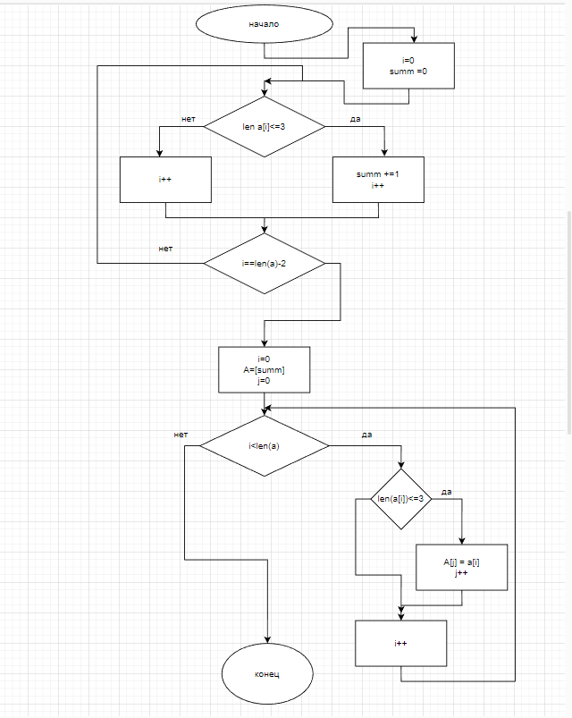

# Итоговая проверочная работа
1. Функция создания массива
2. Функция создания меньшего массива размером в количество элементов размер которых не больше 3 и его заполнения
3. Функция вывода 2х массивов
4. Ввод матрицы с клавиатуры
5. Работа с матрицами
6. Вывод матриц

***
## Блок схема главной функции
